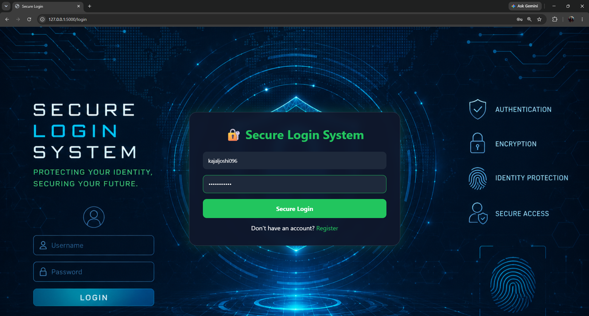
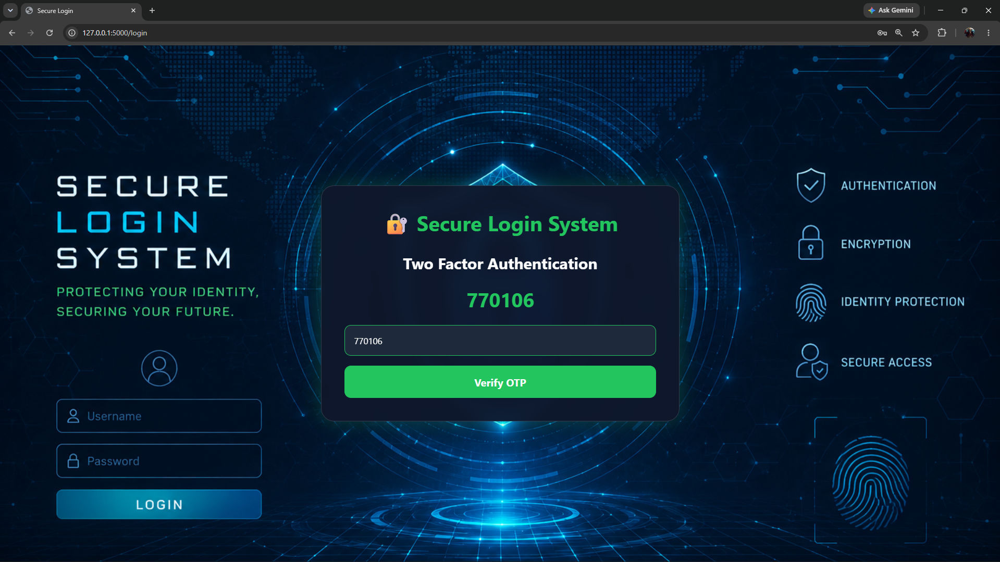

# 🔐 Secure Login System

## Overview

The Secure Login System is a cybersecurity-focused web application built using Flask and bcrypt. It demonstrates secure authentication practices such as password hashing, session management, input validation, and Two-Factor Authentication (2FA).

## Features

* Secure User Registration
* Secure Login Authentication
* bcrypt Password Hashing
* Input Validation
* SQL Injection Protection
* Session Management
* Logout Functionality
* OTP-Based Two-Factor Authentication (2FA)

## Technologies Used

* Python
* Flask
* bcrypt
* HTML
* CSS
* JSON

## Project Structure

```text
Secure-Login-System/

├── app.py
├── users.json
├── requirements.txt
├── README.md

├── templates/
│   ├── login.html
│   ├── register.html
│   └── dashboard.html

├── static/
│   ├── style.css
│   └── background.png

└── screenshots/
```

## Security Features

### Password Hashing

Passwords are securely stored using bcrypt hashing instead of plain text.

### Input Validation

The system validates usernames and passwords to prevent invalid or malicious input.

### SQL Injection Protection

Common SQL injection patterns are detected and blocked.

### Session Management

Only authenticated users can access protected pages.

### Two-Factor Authentication

An OTP verification step is required after successful login for additional security.

## Installation

Install dependencies:

```bash
pip install -r requirements.txt
```

Run the application:

```bash
python app.py
```

Open in browser:

```text
http://127.0.0.1:5000
```

## Screenshots

### Login Page



### Registration Page


### OTP Verification



### Dashboard


## Learning Outcomes

* Secure Authentication
* Password Hashing with bcrypt
* Session Management
* Two-Factor Authentication
* Web Application Security
* Flask Development

## Future Improvements

* Email-Based OTP Verification
* Account Lockout Protection
* Password Reset Functionality
* Login Activity Monitoring
* Database Integration
